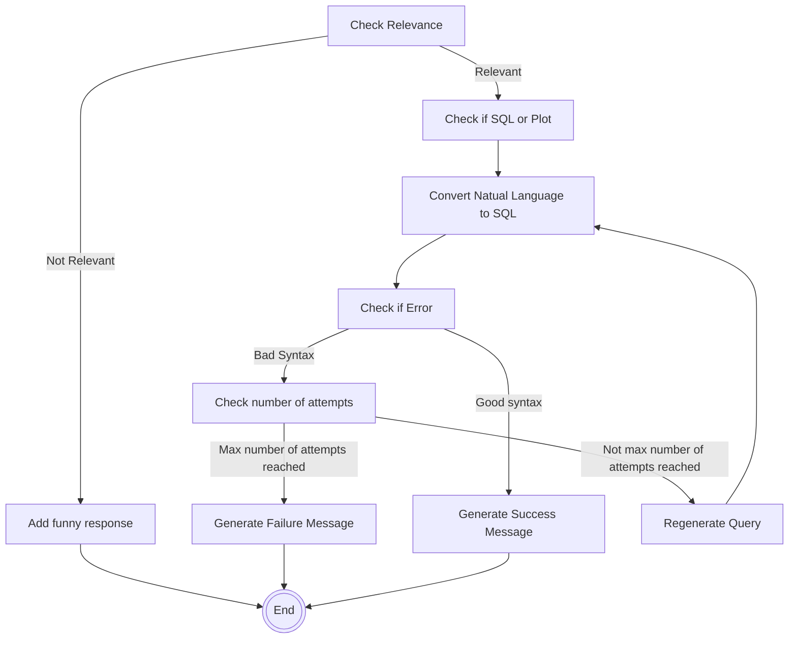

# Insightly
The app that allows Cs not experienced in Excel or Data Science to create beautiful plots and generate useful insights using AI. hello 

### Diagram

```mermaid
flowchart TD;

    stop_execution@{ shape: dbl-circ, label: "End" }

    check_relevance[Check Relevance] -- Relevant --> sql_or_plot[Check if SQL or Plot]
    check_relevance -- Not Relevant --> funny_response[Add funny response]
    funny_response --> stop_execution
    sql_or_plot --> nl_to_sql[Convert Natual Language to SQL]
    nl_to_sql --> check_if_error[Check if Error]
    check_if_error -- Bad Syntax --> num_attempts_check[Check number of attempts]
    check_if_error -- Good syntax --> success[Generate Success Message]
    num_attempts_check -- Max number of attempts reached --> failure[Generate Failure Message]
    failure --> stop_execution
    num_attempts_check -- Not max number of attempts reached --> update_question[Regenerate Query]
    update_question --> nl_to_sql
    success --> stop_execution
```